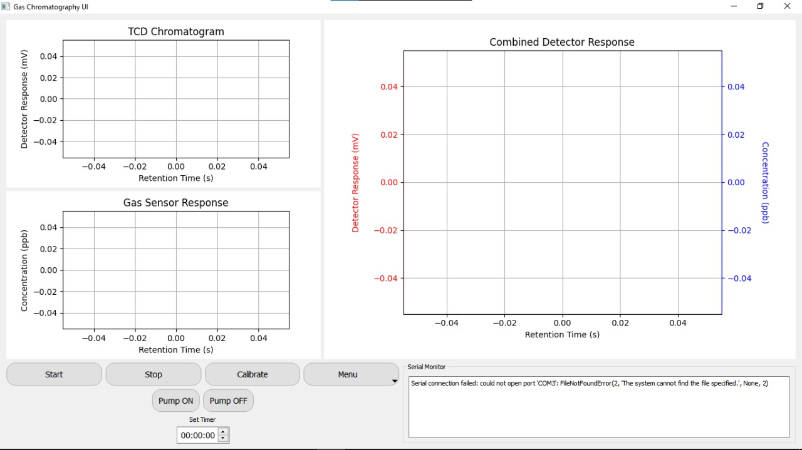
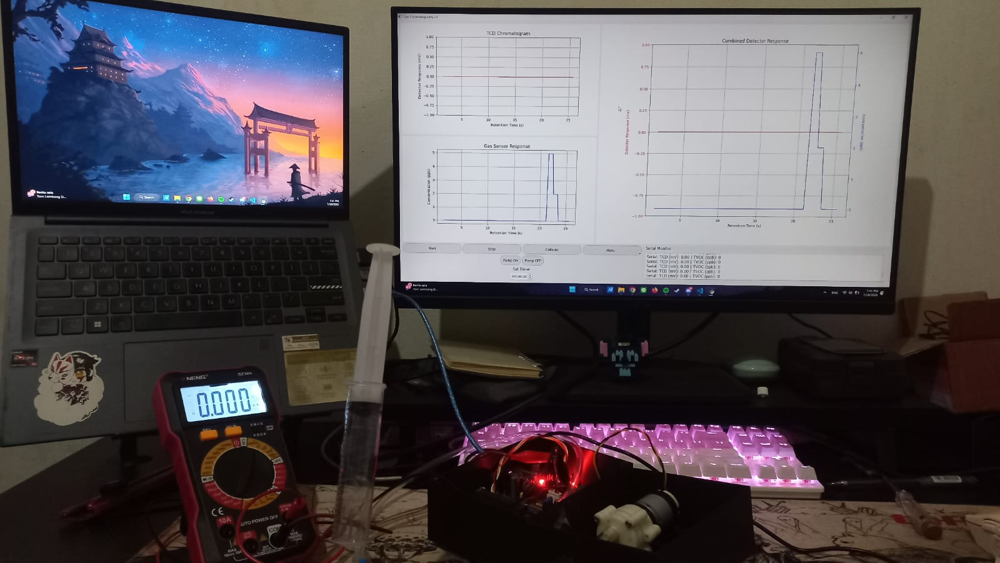

# 💨 GUI Gas Chromatography

Graphical User Interface (GUI) for a DIY Gas Chromatography system using **PyQt5**, **Matplotlib**, and **Serial Communication**, implemented in **Jupyter Notebook** (`00_GUI_gas_chromatography.ipynb`).  
This project provides a real-time visualization and control system for **TCD (Thermal Conductivity Detector)** and **Gas Sensor (TVOC)** responses.

---

## 🖼️ GUI Preview



> Example interface showing the real-time plotting and serial monitor window.

---

## 🔬 Real Setup (Hardware Integration)



> Photo of the working prototype: laptop interface, connected sensors, microcontroller, and pump module.  
> Demonstrates live plotting of both TCD and Gas Sensor signals in real-time.

---

## ⚙️ Features

✅ **Real-Time Plots**
- TCD Chromatogram (mV)
- Gas Sensor Concentration (ppb)
- Combined dual-axis chart (mV vs. ppb)

✅ **Control Panel**
- Start / Stop measurement  
- Calibration button  
- Pump ON / OFF  
- Timer setting  
- Serial Monitor and COM Port selection

✅ **Data Export**
- Automatically or manually save CSV data files.

---

## 🧰 Requirements

Install dependencies using pip:

```bash
pip install -r requirements.txt
```

> 💡 Ensure that Jupyter Notebook or JupyterLab is installed and running properly.

---

## ▶️ How to Run

1. Clone this repository:
   ```bash
   git clone https://github.com/achmadnurnaafi/GUI_Chromatography_Gas.git
   cd GUI_Chromatography_Gas
   ```

2. Open the notebook:
   ```bash
   jupyter notebook 00_GUI_gas_chromatography.ipynb
   ```

3. Connect your microcontroller (Arduino / ESP32 / STM32) to your PC.

4. Run all notebook cells (Shift + Enter).

5. Operate via GUI:
   - Select COM Port
   - Click **Start** to begin measurement
   - View live response and export data to `.csv`

---

## 📊 Expected Serial Data Format

```
TCD (mV): <value> | TVOC (ppb): <value>
```

**Example:**
```
TCD (mV): 123.45 | TVOC (ppb): 678.90
```

---

## 📂 Repository Structure

```
GUI_Gas_Chromatography/
│
├── 00_GUI_gas_chromatography.ipynb   # Main GUI notebook
├── screenshot_gui.jpg                # GUI preview image
├── GUI.jpg                           # Real hardware setup photo
├── requirements.txt                  # Python dependencies
├── .gitignore                        # Files ignored by Git
├── LICENSE                           # Open-source license (MIT)
└── README.md                         # Documentation
```

---

## 👨‍💻 Author

**Achmad Nurnaafi**  
📸 Instagram: [@achmad.naafi_](https://www.instagram.com/achmad.naafi_)  
📧 Feel free to contact for collaboration or questions.

---

## ⚠️ Disclaimer

> This project was developed for **educational and research purposes** only.  
> Please **do not misuse** it for illegal or harmful purposes.  
> The author assumes **no responsibility** for misuse or resulting damage.

---

## 🪪 License

This project is licensed under the **MIT License**.  
See the [LICENSE](LICENSE) file for details.
